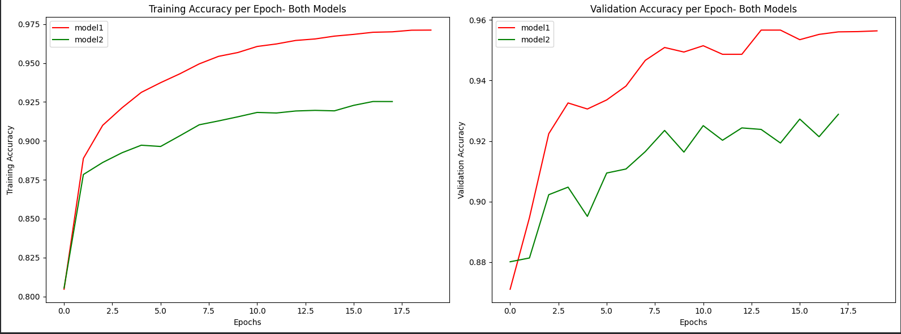
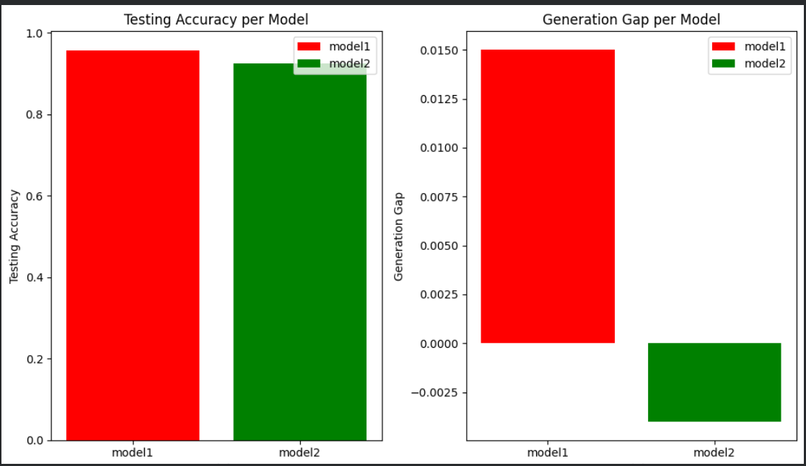
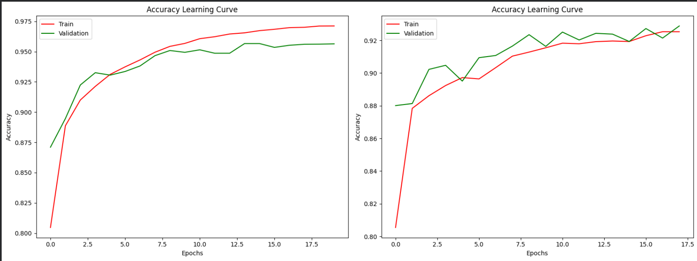
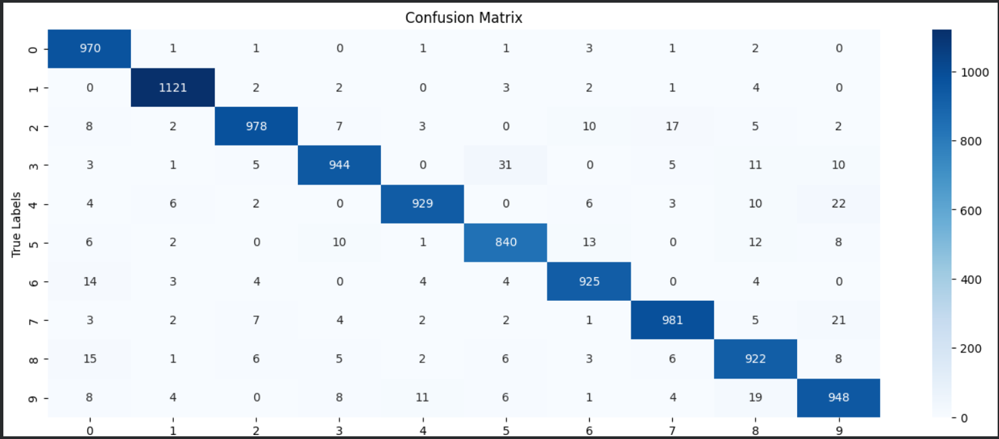

# Handwritten Digit Recognition (MNIST)
- A neural network project that classifies handwritten digits (0–9) from the **MNIST** dataset using TensorFlow/Keras.
- Two dense (fully-connected) neural networks with different activation functions are built, trained, and compared to select the best-performing model.

## Overview
This project:
- Loads and visualizes the MNIST handwritten digits dataset.
- Builds two feed-forward neural network architectures (ReLU vs Sigmoid activations).
- Trains and evaluates both models.
- Compares them using training/validation accuracy, generation gap, and parameter count.
- Selects the best model and analyzes its predictions using a confusion matrix and sample predictions.

## Dataset
The [MNIST dataset](http://yann.lecun.com/exdb/mnist/) is loaded directly via `tensorflow.keras.datasets.mnist`. It consists of:
- **60,000** training images (28x28 grayscale)
- **10,000** test images (28x28 grayscale)
- 10 classes representing digits 0–9

## Model Architectures:
Below  abletshows that both models share the same structure but differ in their hidden layer activation function:
-model1 has relu as aa activation function while model2 has sigmoid as a activation function.
| Layer | Model 1 | Model 2 |
|---|---|---|
| Input | 28x28 | 28x28 |
| Flatten | 784 | 784 |
| Dense (Hidden 1) | 64 units, **ReLU**, L2 regularization | 64 units, **Sigmoid**, L2 regularization |
| Dense (Hidden 2) | 64 units, **ReLU**, L2 regularization | 64 units, **Sigmoid**, L2 regularization |
| Dense (Output) | 10 units, Softmax | 10 units, Softmax |

## Compilation settings (both models):
- Optimizer: `adam`
- Loss: `sparse_categorical_crossentropy`
- Metric: `accuracy`

## Training settings:
- Model 1: 20 epochs, batch size 32, 20% validation split
- Model 2: 18 epochs, batch size 32, 20% validation split
- Random seed fixed at `42` for reproducibility

## Model Comparison
Below comparison matrix shows the parameters that are used to compare both models.
The comparison matrix evaluates both models on:
1. **Training Accuracy** — it defines accuracy on the training data split.
2. **Validation Accuracy** — it defines accuracy on the held-out validation data split.
3. **Generation Gap** (`Train Accuracy - Validation Accuracy`) — it can be used as an indicator of overfitting/underfitting.
4. **Total Parameters** — it defines the complexity of both models.
5. **Test Accuracy** —  it defines the accuracy based on final evaluation on unseen test data.

| Models| Training Accuracy | Validation Accuracy | Generation Gap | Total Parameters
|---|---|---|---|---|
| model1 | 0.971 | 0.956 | 0.015 | 55050 |
| model2 | 0.925 | 0.929 | -0.004 | 55050 |

# Visualization Graphs:
- Below graphs showcasting the train, validation and testing accuracy per epoch of both models and a confusion matrix for best model(model1).
- **Graph 1:**
> 
- **1.From above Training and Validation Graph:**
- We can say that:
  - model1 has high validation accuracy(0.956) as compared to model2(0.929) which plays a important factor in decision making.
  - model1 has also as high training accuracy(0.971) as compared to model2(0.925).
  - This graph shows how quickly each model learns and whether either one plateaus, oscillates, or diverges over time.

- **Graph 2:**
> 
- **1. From Testing Accuracy Graph:**
- We can say that:
  - model1 has high testing accuracy(0.9558) as compared to model2(0.9253).
  - it means that model1 has high final performance on unseen data as compared to model2.

- **2.From Generation Gap Graph:**
- we can say that:
  - model1 has low and healthy generation gap(0.015) as compared to model2(-0.004) which means model2 is slightly underfitting.
  - That means model2 has high validation accuracy than a training accuracy.
  - The generation gap of 0.015 is generally acceptable which is very low.
  - So , we can say that no model is overfitting. 

- **Graph 3:**
> 
- **From Accuracy Learning Graph:**
- We can say that:
  -  The learning curve of training and validation for both models is staying close and improving per epoch.
  -  But due to high validation accuracy than training accuracy in model2, it is slightly moving towards underfitting.

## By analyzing,all the above graph and comparison matrix I can say that the best model is model1.
-**Graph 4: Confusion_Matrix(best_model: model1)**
> 
- **From Confusion_Matrix Graph:**
- We can say that:
- The Diagonal elements of the confusion matrix shows the correct predictions made by best_model.
- The Non-Diagonal elements of the confusion matrix shows the incorrect predictions made by best_model.
